# Step-by-Step WordPress Deployment.
## Introduction
This project provides a comprehensive guide to deploying a WordPress website on a server using a web server **(Apache)** and a database **(MariaDB)**. It walks through environment setup, installation of required dependencies, WordPress configuration, and final deployment steps to make the site publicly accessible. Following this guide ensures a secure, scalable, and production-ready WordPress deployment.

## Feature
- **Dynamic Website** – WordPress provides a fully functional CMS for blogs, portfolios, or business websites.
- **Database-Driven** – Uses MySQL/MariaDB to store content, user data, and settings.
- **Theme and Plugin Support** – Easily customize the site with themes and plugins.
- **Scalable** – Supports multiple users and high traffic when deployed on a proper server.

## Prerequisites
Before deploying the WordPress website, ensure the following are installed and configured:
- **Linux Server** – Amazon Linux
- **Web Server** – Apache installed and running.
- **PHP** – Along with required PHP extensions.
- **Database** – MariaDB for storing WordPress data.

## Steps for Delpoyment
### Step 1: Launch EC2 instance and Establishing a secure connection to your EC2 instance
1. Launch instance 
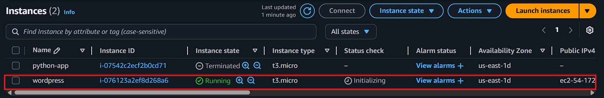

2. Copy the SSH command
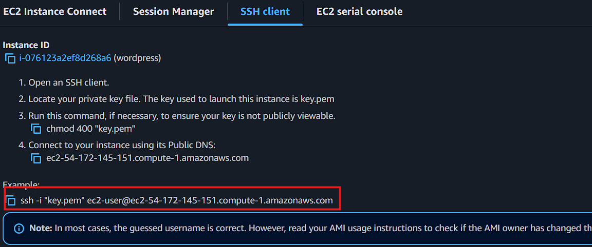

3. Paste command in Git bash
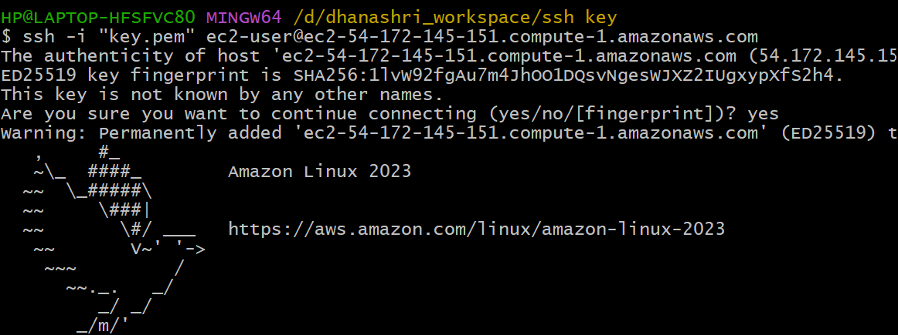

### Step 2: Automating LAMP Stack Setup on AWS EC2 

1. Create a LAMP.sh file
    ``` bash
    sudo vim LAMP.sh
    ```
    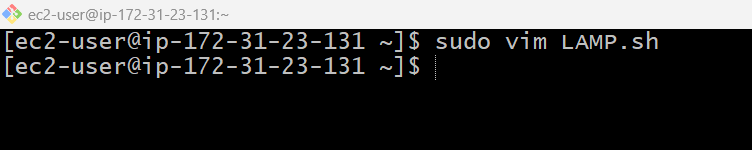

2. Insert the code for installing apache, mysql and php
    ```bash
    sudo yum update
    sudo yum install httpd mariadb105-server php -y
    sudo systemctl start httpd mariadb php-fpm
    sudo systemctl enable httpd mariadb php-fpm
    ```
    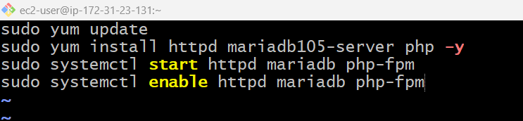

3. Run the file
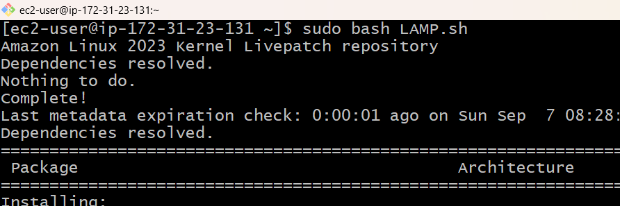

### Step 3: Download and Configure WordPress
``` bash
# Download WordPress
sudo wget https://wordpress.org/latest.tar.gz
# Extract the archive
sudo tar -xvzf latest.tar.gz
```
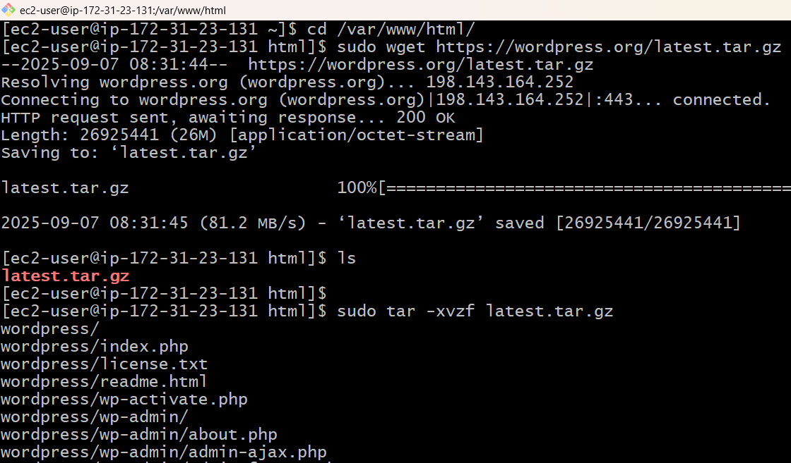

### Step 4: Remove latest.tar.gz
``` bash
sudo rm -rf latest.tar.gz
ls
```
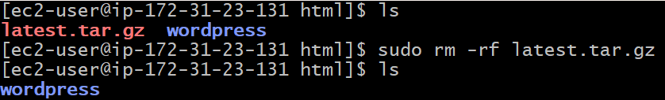

### Step 5: Go to the wordpress folder 
``` bash
cd wordpress/
``` 
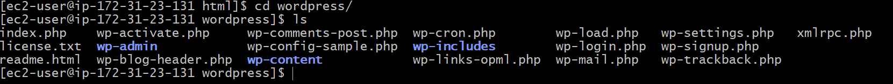

### Step 6: Create WordPress Database
1. Generate the username and password.
    ``` bash
    sudo mysql
    alter user root@localhost identified by 'root';
    ```
     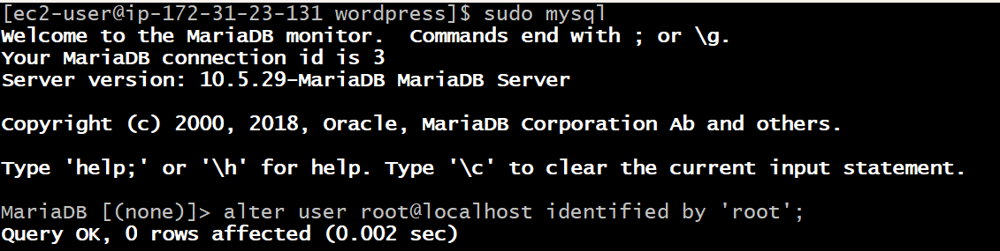
2. Login to Mysql (mariadb105-server)
    ``` bash
    sudo mysql -u root -p
    ```
     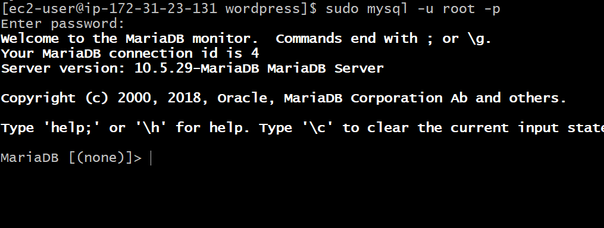

3. Create Database
    ``` bash
    # Create Database
    create database wordpressdb;
    # Show Database
    show databases;
    ```
    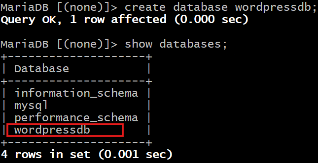

### Step 7: Install Connector
``` bash
sudo yum install php8.4-mysqlnd.x86_64
```
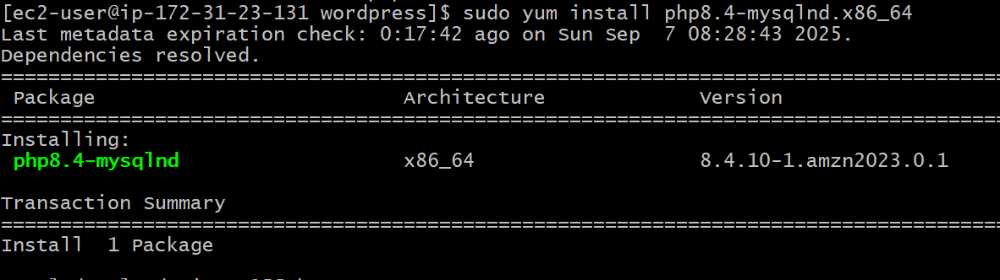

### Step 8: Change ownership of the files
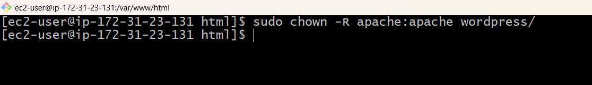

### Step 9: Paste the Public IP and Paste it in any browser.
1. Click on Continue
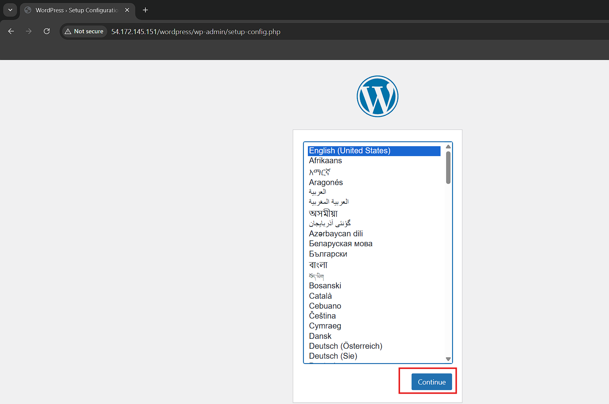
2. Click on Let,s go
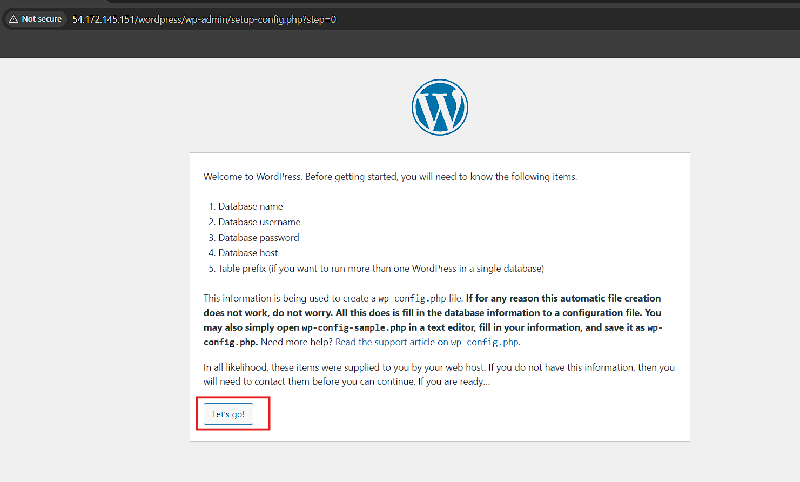
3. Fill the information and click on Submit

4. Run the Installation
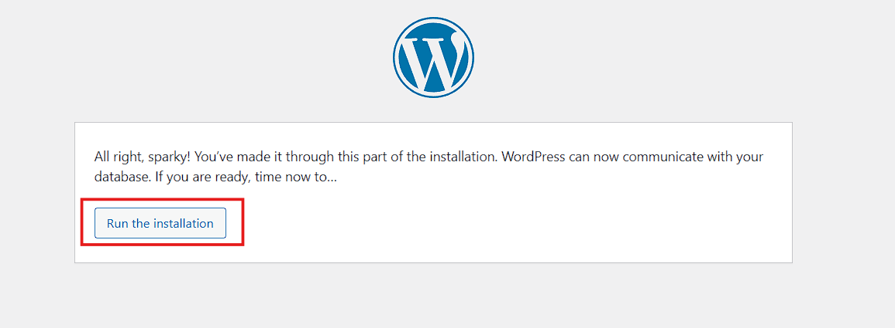
5. Fill the information and click on Install Wordpress
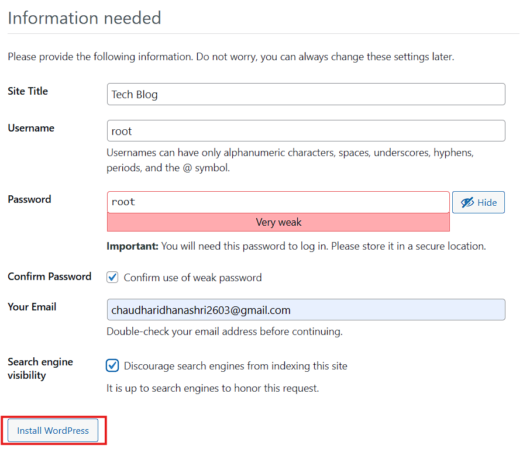
6. Login to Wordpress
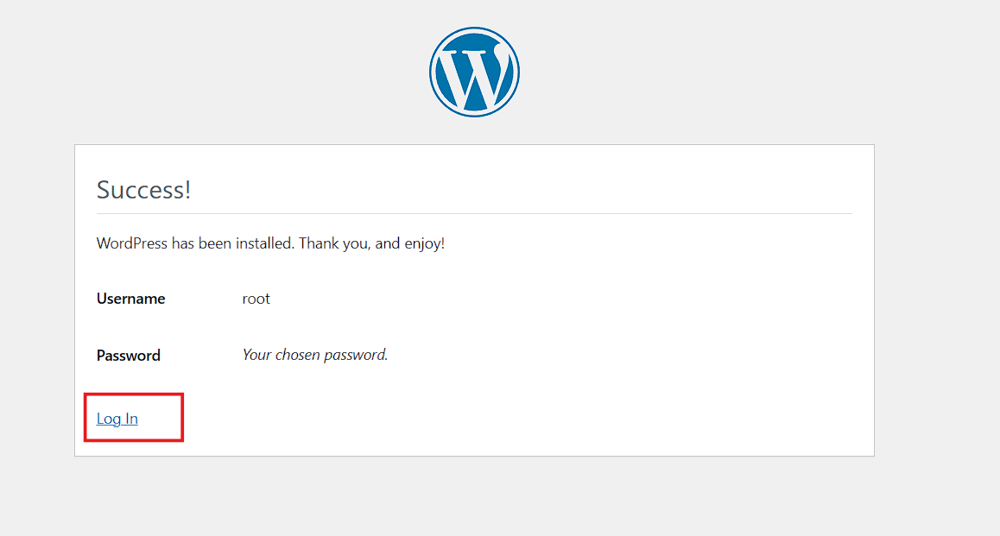
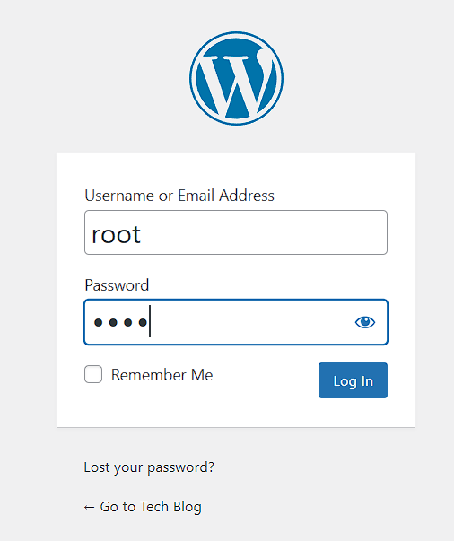
7. Deployed Wordpress successfully 
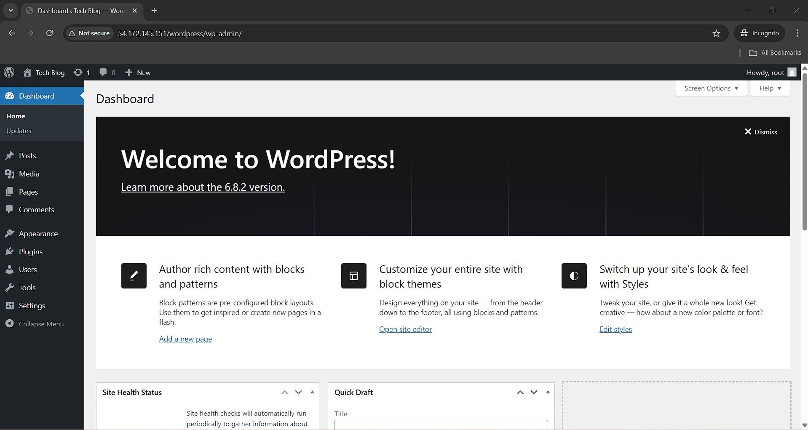
8. Table automatically added to Database
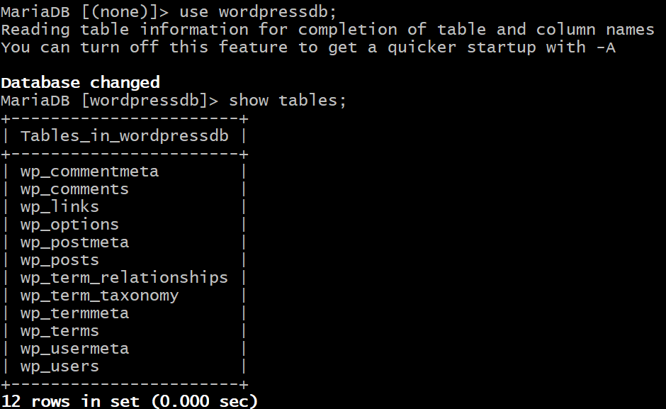

## Summary
This project provides a complete guide to deploying a WordPress website on a Linux server using a web server (Apache) and a database (MariaDB). It covers downloading and installing WordPress, configuring file permissions, setting up the database, and configuring the web server for production use. Following this guide ensures a secure, scalable, and fully functional WordPress site ready for public access.